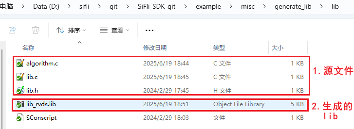

# 生成Lib例程

## 支持的平台和编译环境
<!-- 支持哪些板子和芯片平台 -->
- 跟板子和用的SiFli哪个系列的MCU无关
- 编译Lib的编译环境依赖于正常工程采用的编译环境配置
- 已验证的包括KeilC和GCC环境

## 概述
部分客户为了保密的需要或其他原因不愿意公开源码，需要编译出lib库提供给客户使用，故提供了此例程；


## 编译方法
1. 搭建编译环境<br>
编译lib的前提，是正常的工程用KeilC或者GCC可以编译<br>
2. 把需要生成lib的源文件放在`example\misc\generate_lib\lib`目录下，
该目录下的源文件`*.c,*.h`都会打包编译为一个lib_rvds.lib文件
3. 编译lib<br>
切换到例程`example\misc\generate_lib\project`目录，运行scons命令执行编译：<br>
```
scons -j16
```
其中参数`-j16 `是16线程编译 <br>
编译过程：<br>
<br>
生成如下lib：<br>
<br>
**备注**<br>
编译成lib的文件为`SConscript`文件中定为为`lib`的分组，编译分组在`rtconfig.py`的libname的指定，如果需要可以自行同步修改；<br>
`example\misc\generate_lib\lib\SConscript` 内配置<br>
```
group = DefineGroup('lib', src, depend = [''], CPPPATH = CPPPATH)
```
`example\misc\generate_lib\project\rtconfig.py`内配置<br>
```
libname="lib"
```
## 使用方法
1. 复制生成的`lib_rvds.lib`文件到需要编译的工程目录中，并修改对应目录的SConscript文件，这里以`example\get-started\hello_world\rtt`例程为例，如下图：<br>
<br>
```
path = GetCurrentDir()
lib = ['lib_rvds']
group = DefineGroup('lib', src, depend = [''], LIBS = lib, CPPPATH = path, LIBPATH = path)
```
2. 编译时如果能找到`lib_rvds.lib`内的函数，就链接lib成功了<br>


